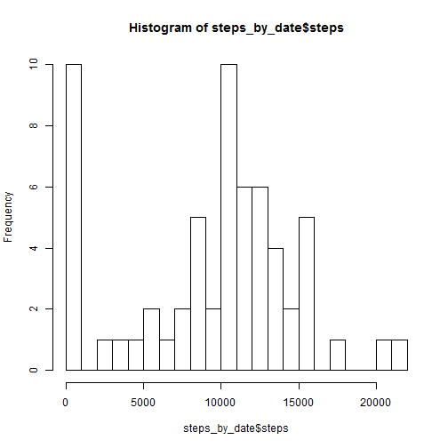
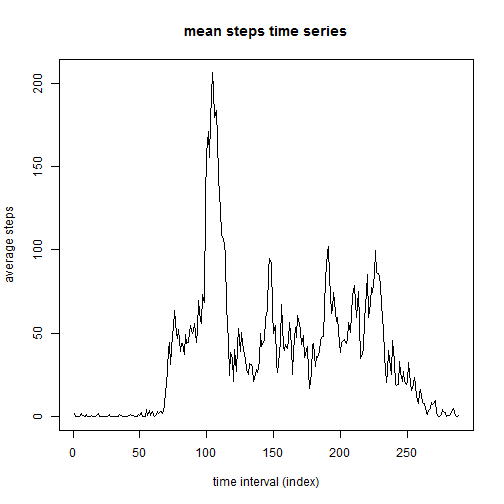
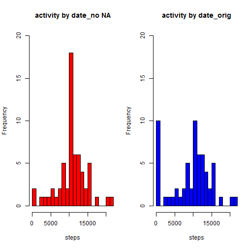
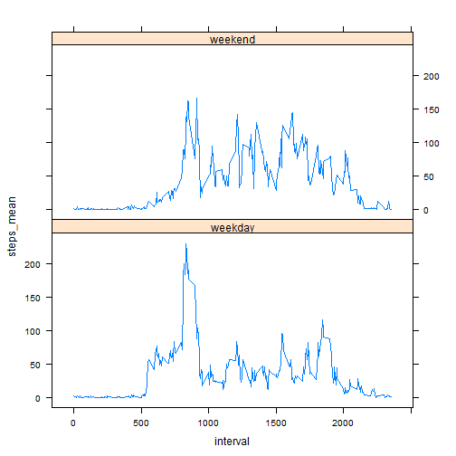

This markdown file makes use of data from a personal activity monitoring device, which collects data at 5 minute intervals through out the day, and analyzes the summary statistics.

The underlying data consists of two months of data from an anonymous individual collected during the months of October and November, 2012 and include the number of steps taken in 5 minute intervals each day.

---

## Data

The data for this assignment can be downloaded from the course web site:

Dataset: Activity monitoring data [https://d396qusza40orc.cloudfront.net/repdata%2Fdata%2Factivity.zip]

The variables included in this dataset are:

- steps: Number of steps taking in a 5-minute interval (missing values are coded as NA)

- date: The date on which the measurement was taken in YYYY-MM-DD format

- interval: Identifier for the 5-minute interval in which measurement was taken

The dataset is stored in a comma-separated-value (CSV) file and there are a total of 17,568 observations in this dataset.

---

## Loading and preprocessing the data stored in local working directory


```r
setwd("C:/DataScientist/ReproResearch/proj1")
activity <- read.csv("activity.csv")
```
---

## Load r packages needed for the analysis


```r
library(dplyr)
library(datasets)
library(lattice)
```
---

## What is mean total number of steps taken per day?

### 1. Calculate the total number of steps taken per day


```r
activity_date <- group_by(activity,date)
steps_by_date <- summarise_each(activity_date,funs(sum(.,na.rm = TRUE)))
```

### 2. Make a histogram of the total number of steps taken each day


```r
hist(steps_by_date$steps, breaks = 22)
```

 

### 3. Calculate and report the mean and median of the total number of steps taken per day


```r
mean(steps_by_date$steps)
```

```
## [1] 9354.23
```

```r
median(steps_by_date$steps)
```

```
## [1] 10395
```

---

## What is the average daily activity pattern?

### 1. Make a time series plot of the 5-minute interval (x-axis) and the average number of steps taken, averaged across all days (y-axis)


```r
#calculate the average number of steps taken for every 5-min interval, averaged across all days
activity_interval <- group_by(activity,interval)
steps_interval <- summarise_each(activity_interval,funs(mean(., na.rm = TRUE)))

#assign index to each interval
interval_index <- match(steps_interval$interval, unique(steps_interval$interval)) 
steps_interval <- mutate(steps_interval,interval_index)

#plot the time series
with(steps_interval,plot(interval_index, steps, type = 'l', main = "mean steps time series", ylab = "average steps", xlab = "time interval (index)"))
```

 

### 2. Which 5-minute interval, on average across all the days in the dataset, contains the maximum number of steps?


```r
steps_interval$interval[which.max(steps_interval$steps)]
```

```
## [1] 835
```
---

## Imputing missing values

### 1. Calculate and report the total number of missing values in the dataset (i.e. the total number of rows with NAs)


```r
sum(is.na(activity$steps))
```

```
## [1] 2304
```

### 2. Creating a new dataset that is equal to the original dataset but with the missing data filled in with the mean for that 5-minute interval 


```r
activity_NoNA <- data.frame(activity, steps_mean = steps_interval$steps)
activity_NoNA$steps[is.na(activity_NoNA$steps)] = activity_NoNA$steps_mean[is.na(activity_NoNA$steps)]
```

### 3. Make a histogram of the total number of steps taken each day. Compare it with the the chart when no imputting of missing values. 


```r
activity_NoNA_date <- group_by(activity_NoNA,date)
NoNA_steps_by_date <- summarise_each(activity_NoNA_date,funs(sum(.,na.rm = TRUE)))

par(mfrow = c(1, 2),mar = c(5, 4.1, 4.1, 1), oma = c(0, 0, 0, 0))

hist(NoNA_steps_by_date$steps, breaks = 22,main = "activity by date_no NA",xlab = "steps", ylim = c(0,20),col = "red")
hist(steps_by_date$steps, breaks = 22,main = "activity by date_orig",xlab = "steps", ylim = c(0,20),col = "blue")
```

 

**Observation:**

-Imputting missing data shifts some of the zero values to positive values.  
-The frequency of zero decreased, while the frequency of other positive values, around mean, increased.

### 4. Calculate and report the mean and median total number of steps taken per day.  Compare the estimates from the first part of the assignment.


```r
mean(NoNA_steps_by_date$steps)
```

```
## [1] 10766.19
```

```r
median(NoNA_steps_by_date$steps)
```

```
## [1] 10766.19
```


```r
###increase of mean steps by day
mean(NoNA_steps_by_date$steps) - mean(steps_by_date$steps)
```

```
## [1] 1411.959
```

```r
###increase of median steps by day
median(NoNA_steps_by_date$steps) - median(steps_by_date$steps)
```

```
## [1] 371.1887
```
---

## Are there differences in activity patterns between weekdays and weekends?

### 1. Create a new factor variable in the dataset with two levels - "weekday" and "weekend" indicating whether a given date is a weekday or weekend day.


```r
weekday <- weekdays(strptime(activity$date, format = "%Y-%m-%d"))
weekday[weekday %in% c("Saturday","Sunday")] <- c("weekend")
weekday[!(weekday %in% c("weekend"))] <- c("weekday")

activity_NoNA_weekdays <- data.frame(activity_NoNA,weekday)
```

### 2. Make a panel plot containing a time series plot of the 5-minute interval (x-axis) and the average number of steps taken, averaged across all weekday days or weekend days (y-axis).


```r
activity_weekday <- filter(activity_NoNA_weekdays,weekday == "weekday")
activity_weekday_interval <- group_by(activity_weekday,interval)
activity_weekday_mean <- cbind(summarise(activity_weekday_interval,mean(steps)),weekday = c("weekday"))

activity_weekend <- filter(activity_NoNA_weekdays,weekday == "weekend")
activity_weekend_interval <- group_by(activity_weekend,interval)
activity_weekend_mean <- cbind(summarise(activity_weekend_interval,mean(steps)),weekday = c("weekend"))

activity_NoNA_interval <- rbind(activity_weekday_mean,activity_weekend_mean)
names(activity_NoNA_interval)[2] <- c("steps_mean")

xyplot(steps_mean ~ interval | weekday, data = activity_NoNA_interval, layout = c(1, 2), type = 'l')
```

 
